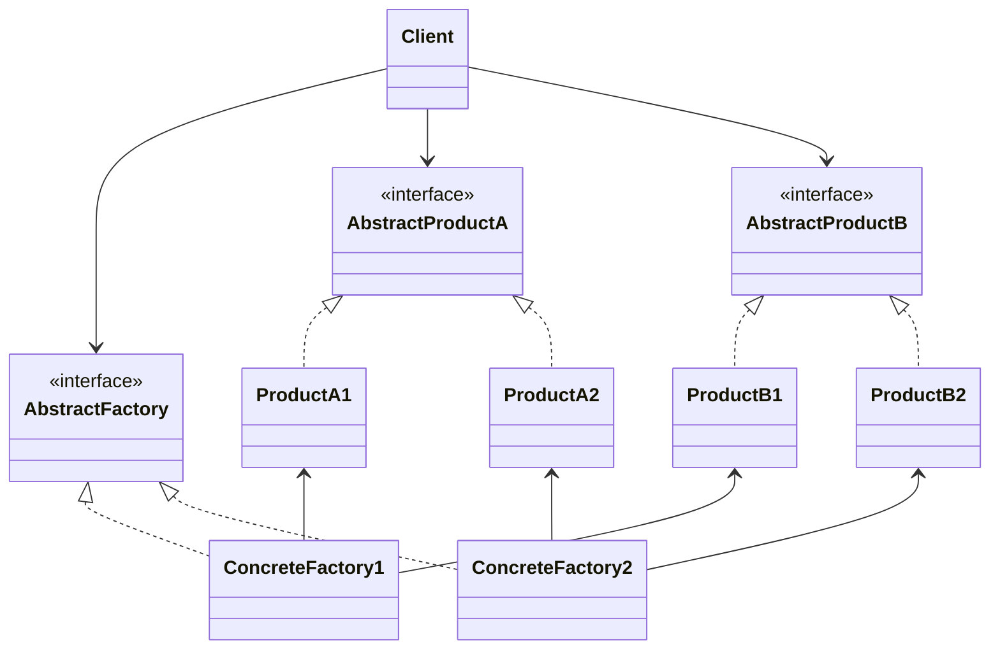

* TOC
{:toc}

# 추상팩토리 패턴에 대하여

```mermaid
classDiagram
direction TD

class Client
class AbstractFactory{
<<interface>>
}
class AbstractProductA{
<<interface>>
}
class ProductA2
class ProductA1
class ConcreteFactory1
class ConcreteFactory2
class AbstractProductB{
<<interface>>
}
class ProductB1
class ProductB2

Client --> AbstractFactory
Client --> AbstractProductA 
Client --> AbstractProductB
AbstractFactory <|.. ConcreteFactory1
AbstractFactory <|.. ConcreteFactory2
AbstractProductA <|.. ProductA1
AbstractProductA <|.. ProductA2
AbstractProductB <|.. ProductB1
AbstractProductB <|.. ProductB2
ProductA1 <-- ConcreteFactory1
ProductB1 <-- ConcreteFactory1
ProductA2 <-- ConcreteFactory2
ProductB2 <-- ConcreteFactory2
```