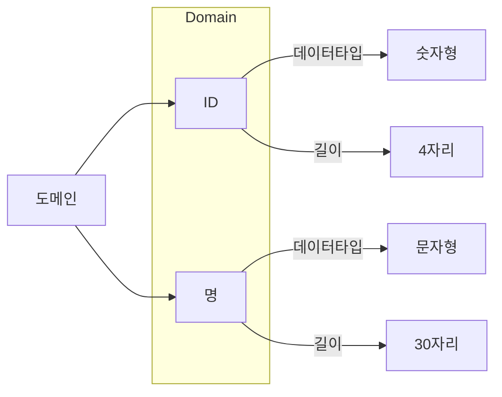

* TOC
{:toc}

# 데이터베이스 모델링이란
## [[ERD]]

# 데이터표준화

## 단어

### 분류어

## 도메인

```mermaid
graph LR

도메인 --> ID
ID -->|데이터타입| 숫자형
ID -->|길이| 4자리
도메인 --> 명
명 -->|데이터타입| 문자형
명 -->|길이| 30자리
subgraph Domain
  ID
  명
end
```

## 용어

# 정규화

## 1 정규화

## 2 정규화

## 3 정규화

## 반정규화

# Links

# 주석