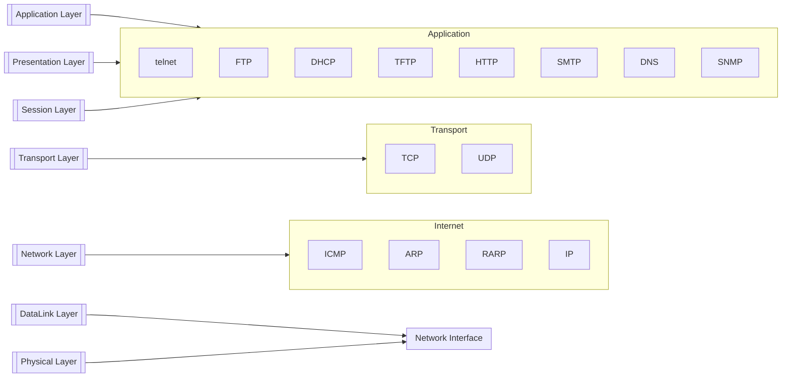

* TOC
{:toc}

# OSI 7계층에 관하여 

```mermaid
flowchart LR
l7[[Application Layer]]
l6[[Presentation Layer]]
l5[[Session Layer]]
l7 --> application
l6 --> application
l5 --> application
subgraph application [Application]
telnet
FTP
DHCP
TFTP
HTTP
SMTP
DNS
SNMP
end

l4[[Transport Layer]]
l4 --> transport
subgraph transport [Transport]
TCP
UDP
end

l3[[Network Layer]]
l3 --> internet
subgraph internet [Internet]
ICMP
ARP
RARP
IP
end

l2[[DataLink Layer]]
l1[[Physical Layer]]
l2 --> networkinterface
l1 --> networkinterface
subgraph networkinterface [Network Interface]

end
```

# Links

# 주석